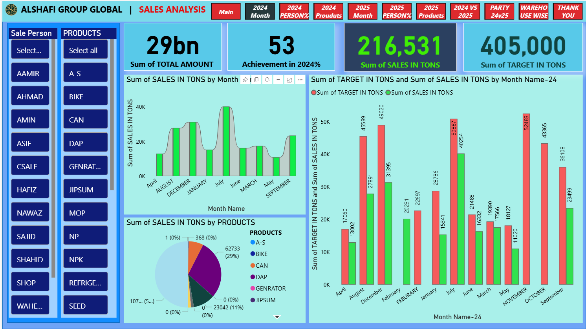
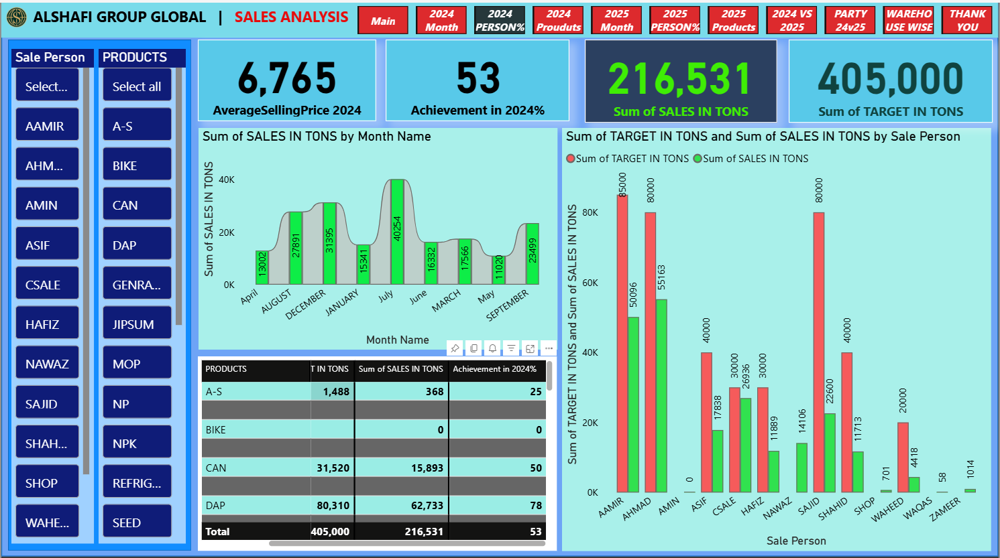
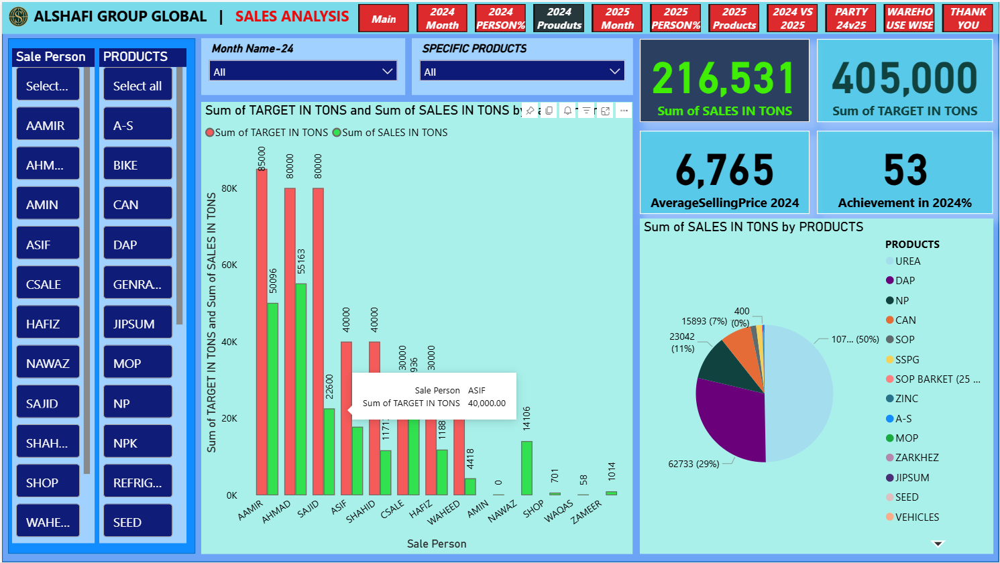
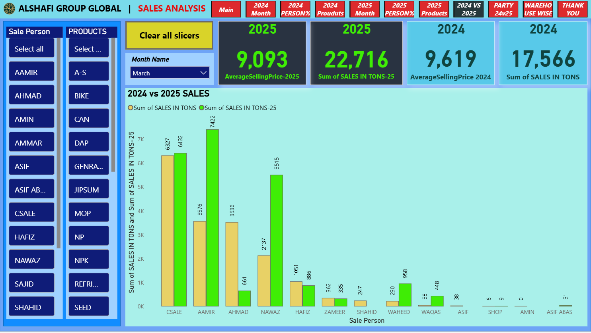
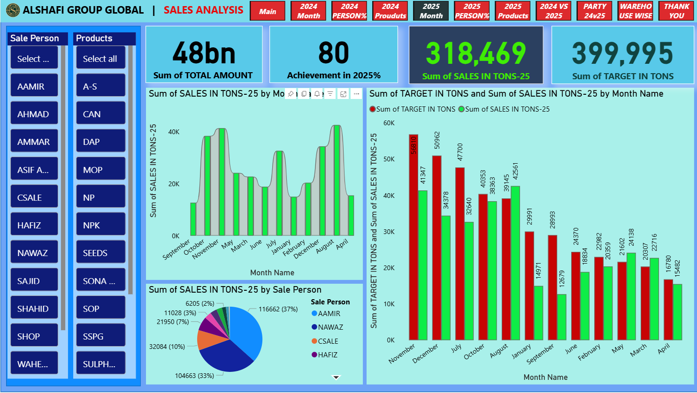
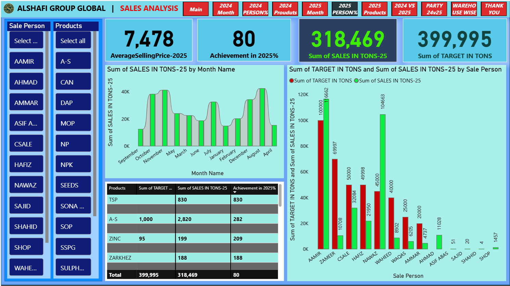
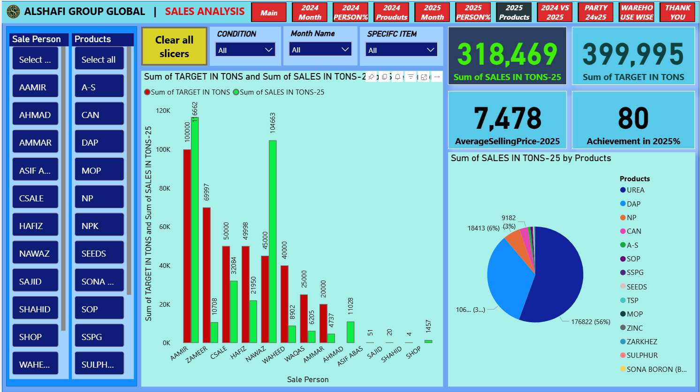
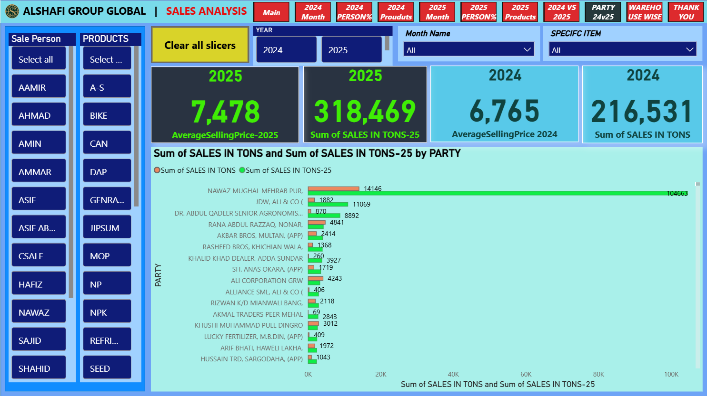
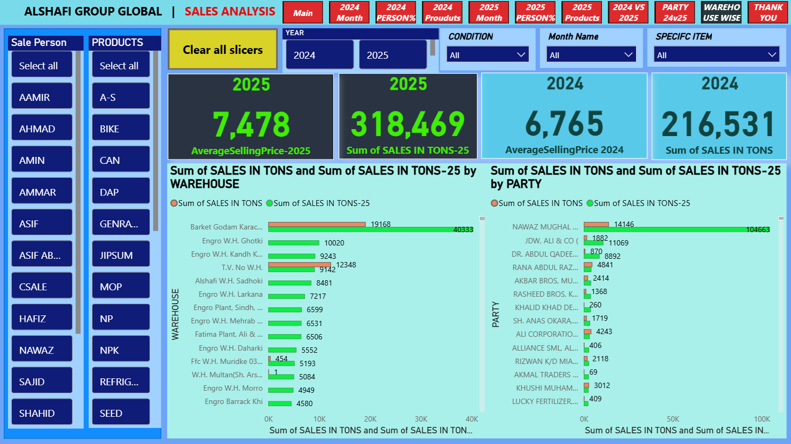
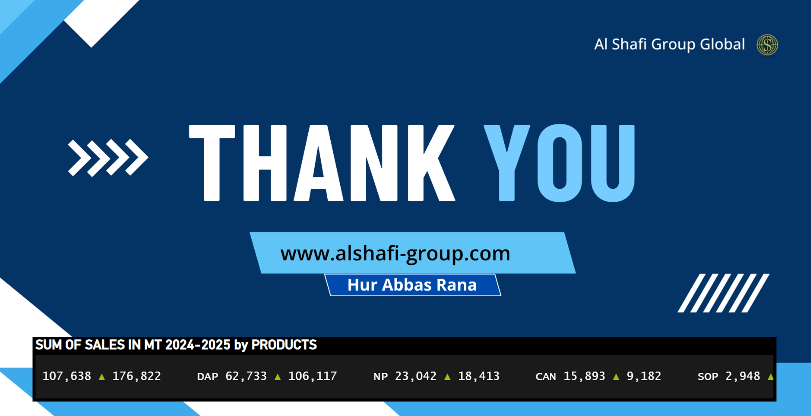

# Power BI Sales Analysis Dashboard | 2024 vs 2025

**Al Shafi Group Global**

Professional interactive Power BI dashboard showcasing comprehensive sales performance analysis and comparison between 2024 and 2025.

## Key Performance Highlights

**2024 Performance**
- Total Sales: **216,531 tons**
- Achievement: **53%**
- Average Selling Price: **6,765**

**2025 Performance**
- Total Sales: **318,469 tons**
- Achievement: **80%**
- Average Selling Price: **7,478**

Significant year-over-year growth in sales volume and target achievement.

## Dashboard Features
- Monthly sales trends with area charts
- Product-wise performance and contribution
- Sales Person analysis
- Party-wise and Warehouse-wise deep dive
- Clear 2024 vs 2025 comparison
- Interactive slicers and filters

## Dashboard Screenshots

## Full Report
[Download Complete PDF Report](AlShafi_Sales_Analysis_2024_2025.pdf)

---

**Created by Hur Abbas Rana**  
Power BI | Sales Analytics | Data Visualization
